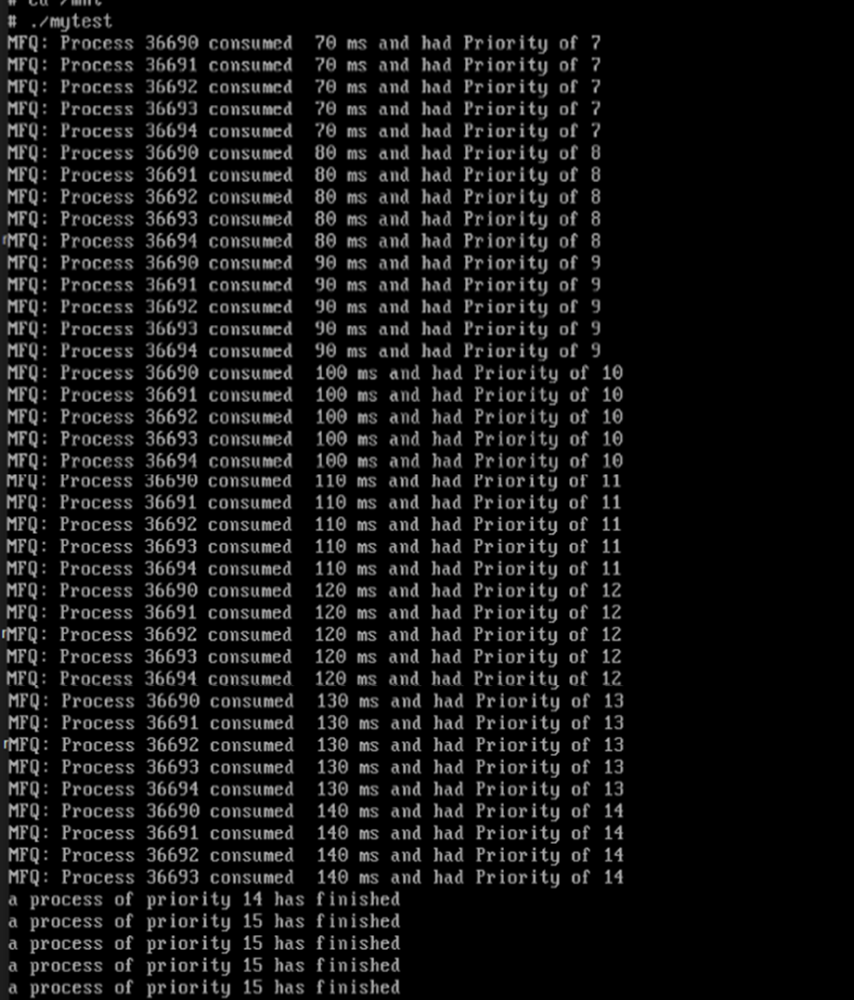
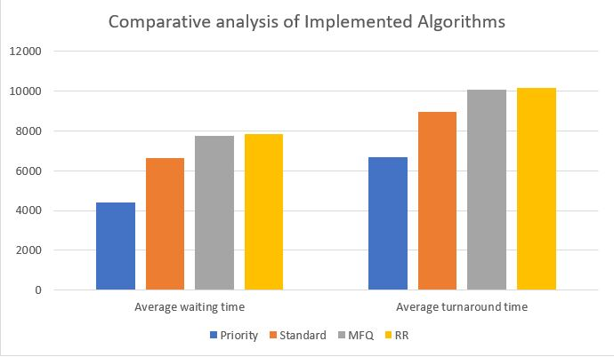

Minix 3 Scheduler
===

In this project, it was required to modify Minix to include different scheduling algorithms, listed below:
- Round Robin
- Shortest Job First (SJF)
- Priority based
- Multi-Level Feedback Queue
  
Each algorithm required a specific modification on the scheduler. A configuration file was created to switch between the different algorithms
This file was added to the global include directory ( ***usr/include*** in minix3 ), so it can be accessed from any needed file.

```
#define MY_SCHEDULING_ALGORITHM  4
#define STANDARD_SCHEDULING_ALGORITHM 1
#define PRIORITY_SCHEDULING_ALGORITHM  2
#define RR_SCHEDULING_ALGORITHM 3
#define MFQ_SCHEDULING_ALGORITHM 4
```


---

The default scheduling policy of minix is **multi-priority round robin queue** . This policy ensures that no process shall consume the CPU for long time, processes which do so will be punished by lowering its priority, and processes who will act ideally will be rewarded by moving them up to a higher priority queue.

The file responsible for scheduling the newly created processes is schedule.c, located in ***“/usr/src/servers/sched/”***  in minix 3.2.1, ***“/minix/minix/servers/sched/”***  in minix 3.3 (this repository), and  ***/usr/src/minix/servers/sched*** in Minix 3.4 , the functions inside these file are called whenever
1. a process is created
2. a process finished its quantum
3. a process is finished
   
The functions responsible for this is as following, respectively:
1.	do_start_scheduling()
2.	do_no_quantum()
3.	do_stop_scheduling()

these functions where modified, along with exploiting the default minix scheduling policy, in order to implement the needed algorithms.

---

1-Round-robin Scheduling Algorithm
---
Since Minix originally uses RR in each queue, this algorithm can be easily implemented by giving all created processes the same priority, and by also disabling the part responsible for lowering the process priority to punish it.

*do_start_scheduling()*
```
if(MY_SCHEDULING_ALGORITHM==RR_SCHEDULING_ALGORITHM)
    rmp->priority=9;     
```
*do_no_quantum()*
```	
if(MY_SCHEDULING_ALGORITHM==RR_SCHEDULING_ALGORITHM)
	{
		if ((rv = schedule_process_local(rmp)) != OK) {
			return rv;
		}

		// since the original minix scheduling algorithm is multilevel priority queue,
		// disabling the feedback (disabling lowering the priority) will result in fixing processes priorities

		// if (rmp->priority < MIN_USER_Q) {
		//	rmp->priority += 1; // lower priority 
		//} 
		return OK; 
	}

```
 


---
2- Priority Scheduling Algorithm
---
Since Minix already multi-priority queues, the modifications in these parts weren’t a lot. For starters, the punishment policy was disabled, same to the RR algorithm

Then, each process was given an enormous time_slice. By doing so, the RR policy of Minix will be disabled (process will be on top of its queue until it finishes).
```
else if(MY_SCHEDULING_ALGORITHM==PRIORITY_SCHEDULING_ALGORITHM&&rmp->priority >=6)
		rmp->time_slice = 10000;
```
 
By doing these 2 steps, priority scheduler was implemented.

As for processes priority, to make a fair test, all incoming processes were given a pseudo random priority, however, this whole snippet can be removed after the test is performed, and processes priorities can be inherited as usual. 

---
3- MFQ Scheduling Algorithm
---
The Policy we chose to implement for this algorithm is as following:
1. 	the process enters the system, it gets to a queue with a specific priority.
2. 	Each queue has specific priority and corresponding quantum size, for example, the third queue has time quantum of 30, the ninth has 90, and so on.
3.	The last queue (queue 15) serves as a first come first served queue.

To implement this process, the do_no_quantum function had the lion share of changes.
As shown here.
```
if(MY_SCHEDULING_ALGORITHM==MFQ_SCHEDULING_ALGORITHM)
	{
        //for testing purposes
		printf("MFQ: Process %d consumed  %d ms and had Priority of %d\n", rmp->endpoint,rmp->time_slice, rmp->priority);
		if (rmp->priority<15)
			{
			rmp->priority+=1;
			rmp->time_slice=rmp->priority*10;
			}
		if (rmp->priority==15)
			rmp->time_slice=500000;
		if ((rv = schedule_process_local(rmp)) != OK) {
			return rv;
		}
		return OK; 
	}
```
  when the do_no_quantum is called (a process finishes its CPU time),the process priority decreases, and its time quantum increases. If the priority reaches 15 (the lowest priority) the process is given an enourmous time_slice, this converts the last queue to  become a FCFS queue, which agrees with our policy. 

--- 
Test plan and Reuslts
---
We created a general test file than create N processes, each one is a huge loop with different sizes that consumes CPU and each one has a specific code to calculate the following:
1.	The process Turnaround time
2.	The process Execution time
3.	The process Waiting time

The implementation of the test files is provided in  ***/mnt*** directory:

This test gets the time at which each process was created in **(not when it was first run)**, then after the process finishes it gets the time again, in addition, it gets the loop size so we can estimate its execution time, at the end of this process it calculates its statistics and send it to a text files for results.

 
## Results

### RR Algorithm
The following figure illustrates how processes follow the RR scheduling manner


And the following are snippets from the results file


For each test, 5 processes of different sizes where created, for test purposes, the process size was inversely proportional to its number, so that it doesn’t seem FCFS.
As shown in the results, the turn around time is very high in all processes, even the shortest one, however, all processes were granted an equal share of the CPU, which is the main goal of using RR algorithms in Operating systems.

|	Average waiting time|	Average turnaround time|
| ----------- | ----------- |
|7746ms 		  |		10033.3ms |


### Priority
The following figure illustrates how processes follow the Priority scheduling manner


And the following are snippets from the results file


|Average waiting time|Average turnaround time|
| - | - |
|4402.6|	6690|


### MFQ
The following figure illustrates how processes follow the Priority scheduling manner, note that all processes reached to the last (FCFS) queue, except of one process, which was finished in the queue before the last one.



The results of the MFQ algorithm are shown below

  
|Average waiting time|Average turnaround time|
| - | - |
|7842.6|	10130|


## Conclusion
A comparative analysis across the different algorithms and the results  are shown below	



As expected, the Priority scheduling algorithm had both lowest turnaround and waiting times it achieved better results than Minix standard scheduling algorithm, however, both MFQ and RR algorithms had a very close, higher than standard algorithm results. The reason behind this is that the MFQ policy has RR algorithms in all of its queues except the last one (FCFS) so, for most processes, they deal with this RR approach, as a result, the turnaround time for MFQ and RR is both very high and close.


